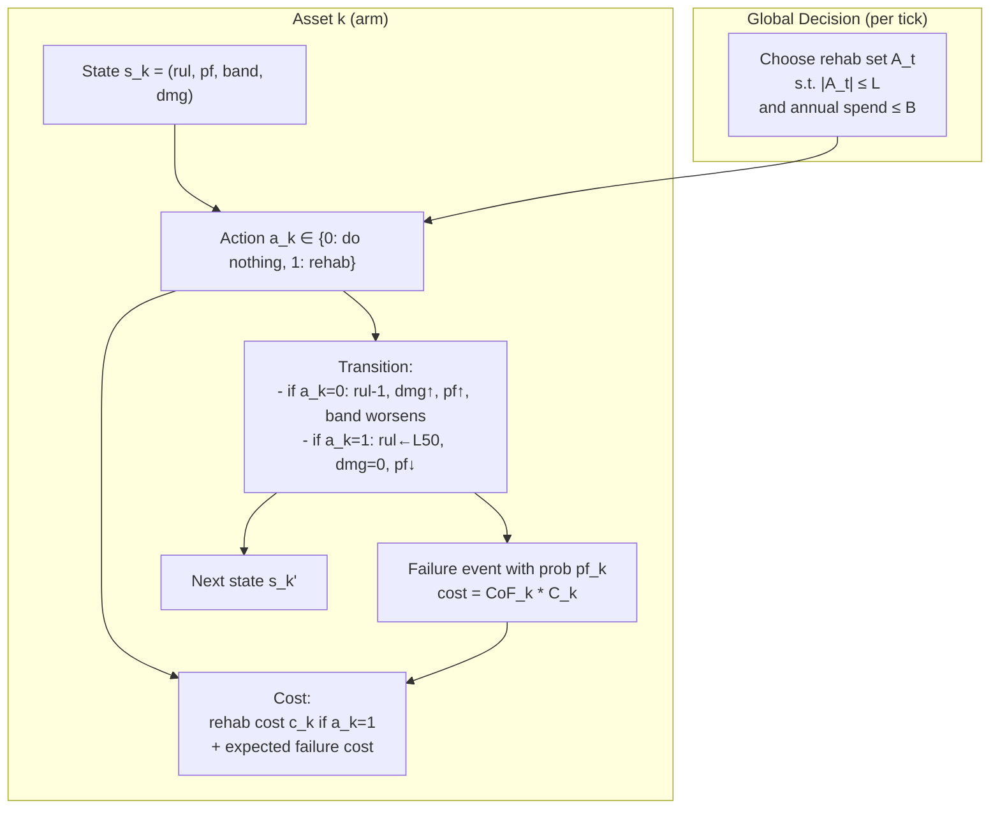

# Asset Management MDP (Restless Bandit Framing)

This document sketches an MDP-style model (restless bandit with budget and activation limits) for large-scale asset rehabilitation under failure risk, remaining useful life (RUL), and consequence of failure (CoF).

## Problem Summary

- Many assets, each with:
  - Failure probability (PF) and remaining useful life (RUL).
  - PF stratified into risk bands: Extreme, High, Medium, Low, Negligible.
  - Consequence of failure score `CoF_k ∈ {1..10}`.
  - Rehab cost `c_k`, replacement cost `C_k`.
- At each time tick (day):
  - RUL decreases.
  - PF evolves (e.g., increases as damage accumulates).
- Actions:
  - Rehabilitate asset `k` (reset to L50 life).
  - Do nothing (asset continues to age).
- Constraints:
  - Can rehabilitate at most `L` assets per tick.
  - Annual rehab budget `B`.
- Objective:
  - Minimize expected total cost of failure (CoF) and interventions, discounted by `γ`.

## Modeling Choice

This is well-fit to a **restless bandit MDP**:

- Each asset is an arm with its own state and dynamics.
- All assets evolve every time tick, even if not rehabilitated (restless).
- At each day, select up to `L` assets for rehab subject to budget.

## State, Actions, Transitions, Costs

**Per-asset state (example):**

- `s_k = (rul_k, pf_k, band_k, dmg_k)` where:
  - `rul_k` in discrete bins (years remaining).
  - `pf_k` or `band_k` (Extreme..Negligible).
  - `dmg_k` optional damage fraction in `[0,1]`.

**Actions:**

- `a_k = 1` (rehabilitate): reset `rul_k` to L50, reduce `pf_k`, set `dmg_k = 0`.
- `a_k = 0` (do nothing): asset ages, risk worsens stochastically.

**Transition sketch:**

- If `a_k = 0`:
  - `rul_k` decreases by 1.
  - `dmg_k` increases (deterministic or stochastic).
  - `pf_k` increases or transitions to a worse risk band.
  - Failure occurs with probability `pf_k`, triggering replacement cost `C_k`.
- If `a_k = 1`:
  - `rul_k` ← L50, `pf_k` reduced, `dmg_k` ← 0.

**Cost per day (expected):**

- Rehab cost: `c_k` if `a_k = 1`.
- Expected failure cost: `pf_k * (CoF_k * C_k)` or `pf_k * C_k` scaled by CoF.
- Optional operational penalty for high risk band.

## Objective

Minimize discounted total expected cost:

```
minimize  E[ Σ_t γ^t ( Σ_k (a_k^t * c_k) + Σ_k (pf_k^t * CoF_k * C_k) ) ]
```

Subject to:

- `Σ_k a_k^t ≤ L` (capacity per day)
- Annual budget: `Σ_{t in year} Σ_k a_k^t * c_k ≤ B`

## Diagram (Restless Bandit MDP)



## Notes on Damage Fraction (Optional)

If a damage fraction model is preferred:

- `dmg_k ∈ [0,1]` with `pf_k = f(dmg_k, env_k)` (e.g., logistic or Weibull CDF).
- `dmg_k` increments each tick; rehab sets `dmg_k = 0`.
- Risk band is a discretization of `pf_k` for reporting/prioritization.

## Practical Policy Options

Given scale and constraints:

- **Whittle index policy** (if indexable) for near-optimal dispatch under `L`.
- **Budget-aware heuristic**: rank by `pf_k * CoF_k * C_k` or an index + cost.
- **Constrained MDP** with Lagrangian for budget `B`.

If you want, I can refine this into a formal CMDP or add a mathematical definition block.

